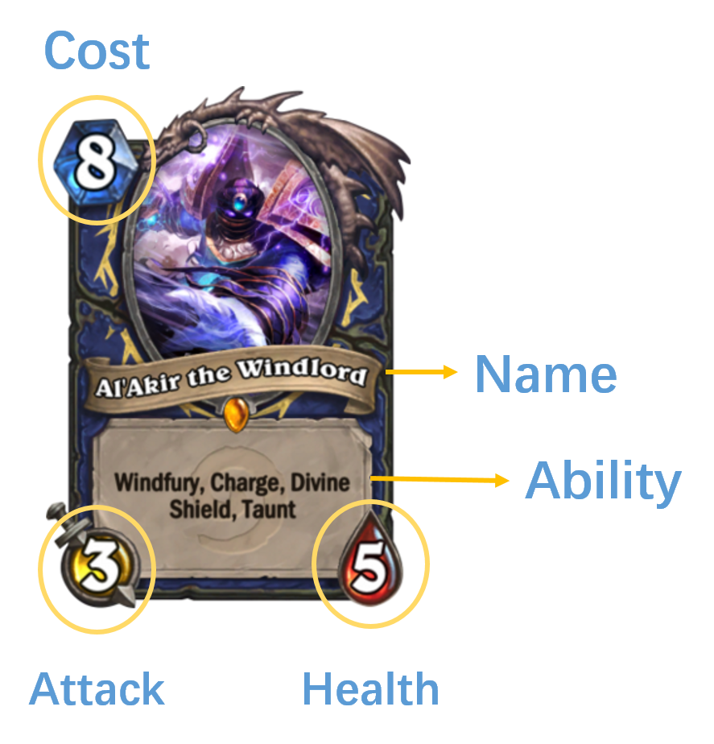

## Overview and Motivation:
Some of our team members are loyal fans of the popular free online card game, Hearthstone: Heroes of Warcraft, which was released worldwide by Blizzard on 2014 with more than 40 million registered Hearthstone accounts by November 2015.

The main element of the game Hearthstone are cards, which consist of a list of features including cost, attack (number of damages can be made to the opponent per turn),health (number of damages that can bear before being destroyed) and other special abilities. Here is an example of the card: 

Before every game starts, each of the two players will choose 1 hero mode among the 9 and then select 30 different cards over 700 cards to build his/her own deck depending on the mode. Each turn, the player will draw one card randomly from the 30 cards and one more mana crystal (money). The player can choose the cards to use among all those in hand that cost up to the mana crystals he/she has by that turn. The game ends when one player is attacked to death (lose all 30 units of health) or he/she concedes, and the other player will win. 

Therefore, the initial building of the 30 cards, as well as the choices of cards to use during the game will directly influence the results of the game. This motivated us:

* To evaluate the value of all cards.
* To explore the correlation between cards.
* To decide the set of core cards and number of drawing cards.
* To explore the number of different costs of card in a deck with simulations.
* To build a deck with optimal combined strength. 


## Initial Questions: 
>__1. What are the "true" values of individual cards? Are there any properties the Blizard company used to assign values (cost) of these cards? Is there any card undervalued/overvalued by the company?__

* This was considered as the __first stage__ of our analysis. In this stage, we aimed to estimate the value of each card independently, only considering the basic information from the card itself, i.e. attack, health, special ability.

>__2. What is the balance between low cost cards and high cost cards? __

* This is the __second stage__ of our analysis. The card a player can use is restricted by the number of mana he/she has for that turn, starting from 1 at the beginning and will reach to a maximum of 10 since the 10th turn. If there is no card with cost less than or equal to the number of mana in that turn, the player cannot use any card. 
Note that without this consideration, we may choose all 30 cards to be with very high cost -- however, we are not able to use them in the first several turns. If the opponent do have small cards, we may be attacked to death before we could ever use any card.
We aimed to simulate the possibilities of playing a card in the first 5 turns. 


>__3. Are there any "core" combination of cards?__

* This is the __third stage__ of our analysis. We aimed to estimate the correlation between cards in certain decks of a specific hero and hope to create card combinations based on principal component analyses. In deciding the number of core cards, we also want to explore the number of drawing cards we need, in order to be able to get the core cards in the random drawing during the game.

>__4. Are we able to build a powerful deck (30 cards) for some heros?__

* With all our analysis in previous stages, we aimed to build potentially powerful decks for certain heros.

On the fifth stage, we will build an optional deck based on the efforts above and decide the strategy for the ordering of the card to use. We can test our model by simulating games using the deck and strategy we developed, and calculate its percentage of winning (optional).

## Related Work:


##library
Here are the libraries we have used in our project.
```{r, warning= F error=F}
library(rjson)
library(dplyr)
library(tidyr)
library(knitr)
library(readr)
library(stringr)
library(ggplot2)
library(gridExtra)
library(graphics)
library(plotrix)
library(grid)
library(ggrepel)
library(scales)
library(cowplot)
library(rvest)
library(XML)
library(vegan)
library(RColorBrewer)
library(gplots) 
library(devtools)
library(reshape)
library(dendextend)
library(reshape2)
library(VGAM)
```


## Data:

We have two types of data: 1) basic card information (attack/health/cost/description of cards) and 2) frequently used decks from top players. 

* __Basic card information:__ We collected card data from Hearthstone’s API: http:,, hearthstoneapi.com, Card.  It contains thorough card information of: card name, card set (Basic, Classic, Blackrock Mountain,  Goblins vs Gnomes,  Naxxramas,  Promotion,  The Grand Tournament,  The League of Explorers), card type (minions,  spells,  weapons), player class (Priest,  Hunter,  Warlock,  Shaman,  Warrior,  Mage,  Paladin,  Druid,  Rogue,  All), card description (text), 	mechanics of minions (Battlecry,  Taunt,  Normal,  HealTarget,  Charge,  Aura,  AdjacentBuff,  Spell Damage,  Freeze,  Enrage,  Divine Shield,  Stealth,  Overload,  Deathrattle,  Windfury,  Combo,  Poisonous,  Inspire), attack, health, and cost of cards. We have collected the json file using Python and transfer it into RData (and csv files) using R.

```{r eval=F warning=F error=F}
## Data wrangling from json to RData:

json_file = "cards2.txt"
data <- fromJSON(file = json_file)
card_category = names(data)

not_empty = which(sapply(1:length(data), function(i){length(data[[i]])})>0)

card_category = card_category[not_empty]

data = lapply(not_empty, function(i){data[[i]]})
data1 = lapply(1:length(data), function(k) {lapply(data[[k]],
                                                   function(i) {lapply(i, function(j){
                                                     j = ifelse(is.null(j),NA,j)})})})

col_names = lapply(1:length(data1),
                   function(k) {
                     lapply(1:length(data1[[k]]),
                            function(i) {names(data1[[k]][[i]])})})

data2 = lapply(1:length(data1), 
           function(k) {
             lapply(1:length(data1[[k]]),
                    function(i) {
                      matrix(unlist(data1[[k]][[i]]), 
                             ncol = length(data1[[k]][[i]]), 
                             byrow = T)})})

for(k in 1:length(data2)){
  colnames(data2[[k]][[1]]) = col_names[[k]][[1]]
  data2[[k]][[1]] = data.frame(data2[[k]][[1]])
  for(i in 2:length(data2[[k]])){
    colnames(data2[[k]][[i]]) = col_names[[k]][[i]]
    data2[[k]][[i]] = data.frame(data2[[k]][[i]])
    data2[[k]][[i]] = bind_rows(data2[[k]][[i-1]],data2[[k]][[i]])
  }
  assign(card_category[k], tbl_df(data2[[k]][[length(data2[[k]])]]))
}

final_data = get(card_category[1])
for (i in 2:length(data2)){
  final_data = bind_rows(final_data, get(card_category[i]))
}
# write.table(final_data, file = "final_data.csv", sep = "\t")
# save(final_data, file = "final_data.RData")
```

Data wrangling of card descriptions:
This part is aimed for detailed classification of minion card descriptions (other than the mechanics they are currently classified as). 

1. For some minions that have more than one mechanics (e.g. Taunt that has deathrattle), they are only classified as one of their mechanics in the Hearthstone dataset. The following wrangling aims to classify them with all the mechanics they have with dummy variables (having certain feature = 1 vs. without certain feature = 0).

```{r eval=F warning=F error=F}

load("minions.RData")
minions_text = tbl_df(minions) %>%
  select(-ID, -flavor, -type, -artist, -collectible, -howToGet, -howToGetGold, -img, -imgGold, -locale, -race, -faction, -elite) %>%
  mutate(playerClass = ifelse(is.na(playerClass), "All", as.character(playerClass)))

minions_text = minions_text %>% 
  mutate(text = as.character(text)) %>%
  mutate(text = gsub("<b>", "", text)) %>%
  mutate(text = gsub("</b>", "", text)) %>%
  mutate(text = gsub("\xa1\xaf", "'", text)) %>%
  mutate(text = ifelse(is.na(text), "None", text)) 

minions_text = minions_text %>%
  mutate(AdjacentBuff= ifelse(text %in% minions_text$text[grep("AdjacentBuff",minions_text$text)], 1, AdjacentBuff))%>% 
   mutate(Aura= ifelse(text %in% minions_text$text[grep("Aura",minions_text$text)], 1, 0))%>% 
   mutate(Battlecry = ifelse(text %in% minions_text$text[grep("Battlecry",minions_text$text)], 1, Battlecry))%>%
  mutate(Charge= ifelse(text %in% minions_text$text[grep("Charge",minions_text$text)], 1, Charge))%>%
 mutate(Combo = ifelse(text %in% minions_text$text[grep("Combo",minions_text$text)], 1, Combo))%>%
  mutate(Deathrattle = ifelse(text %in% minions_text$text[grep("Deathrattle",minions_text$text)], 1, Deathrattle))%>%
  mutate(Divine_Shield = ifelse(text %in% minions_text$text[grep("Divine_Shield",minions_text$text)], 1, Divine_Shield))%>%
  mutate(Enrage = ifelse(text %in% minions_text$text[grep("Enrage",minions_text$text)], 1, Enrage))%>%
  mutate(Inspire = ifelse(text %in% minions_text$text[grep("Inspire",minions_text$text)], 1, Inspire))%>%
  mutate(Overload= ifelse(text %in% minions_text$text[grep("Overload",minions_text$text)], 1, Overload))%>%
  mutate(Poisonous = ifelse(text %in% minions_text$text[grep("Poisonous",minions_text$text)], 1, Poisonous))%>%
  mutate(Windfury = ifelse(text %in% minions_text$text[grep("Windfury",minions_text$text)], 1, Windfury))
  
```

2. The beauty of Hearthstone (and the most difficult part for quantitative analysis) is that almost every minion has its unique feature that are described in text on the card. Therefore, it's hard to "value" a card without taking these descriptions into account while on the other hand, texts them selves are difficult to be simply quantified. The following wrangling aims to identify certain verbs (deal, restore, etc.) and nouns (attacks, healths, etc.) frequently used in the card description and tried to classifiy cards with more features that were not classified by their mechanics.

```{r eval=F warning=F error=F}
minions_text = minions_text %>%
  mutate(Choice = ifelse(text %in% minions_text$text[grep("; or",minions_text$text, ignore.case = T)], 1, 0)) %>% 
  mutate(Conditional = ifelse(text %in% minions_text$text[grep("if",minions_text$text, ignore.case = T)], 1, 0)) %>% 
  mutate(Conditional = ifelse(text %in% minions_text$text[grep("whenever",minions_text$text, ignore.case = T)], 1, Conditional)) %>% 
  mutate(Conditional = ifelse(text %in% minions_text$text[grep(",",minions_text$text, ignore.case = T)], 1, Conditional)) %>% 
  mutate(Add = ifelse(text %in% minions_text$text[grep("add",minions_text$text, ignore.case = T)], 1, 0)) %>%
  mutate(Cast = ifelse(text %in% minions_text$text[grep("cast",minions_text$text, ignore.case = T)], 1, 0)) %>% 
  mutate(Deal = ifelse(text %in% minions_text$text[grep("Deal",minions_text$text, ignore.case = T)], 1, 0)) %>%
  mutate(Destroy = ifelse(text %in% minions_text$text[grep("destroy",minions_text$text, ignore.case = T)], 1, 0)) %>% 
  mutate(Discover = ifelse(text %in% minions_text$text[grep("discover",minions_text$text, ignore.case = T)], 1, 0)) %>% 
  mutate(Draw = ifelse(text %in% minions_text$text[grep("draw",minions_text$text, ignore.case = T)], 1, 0)) %>% 
  mutate(Discard = ifelse(text %in% minions_text$text[grep("discard",minions_text$text, ignore.case = T)], 1, 0)) %>% 
  mutate(Freeze = ifelse(text %in% minions_text$text[grep("freeze",minions_text$text, ignore.case = T)], 1, Freeze)) %>% 
  mutate(Gain = ifelse(text %in% minions_text$text[grep("gain",minions_text$text, ignore.case = T)], 1, 0)) %>%
  mutate(Give = ifelse(text %in% minions_text$text[grep("give",minions_text$text, ignore.case = T)],1,0)) %>%
  mutate(Reduce = ifelse(text %in% minions_text$text[grep("reduce",minions_text$text, ignore.case = T)], 1, 0)) %>% 
  mutate(Remove = ifelse(text %in% minions_text$text[grep("remove",minions_text$text, ignore.case = T)], 1, 0)) %>% 
  mutate(Restore = ifelse(text %in% minions_text$text[grep("restore",minions_text$text, ignore.case = T)], 1, 0))%>%
  mutate(Reveal = ifelse(text %in% minions_text$text[grep("reveal",minions_text$text, ignore.case = T)],1,0)) %>%
  mutate(Silence = ifelse(text %in% minions_text$text[grep("silence",minions_text$text, ignore.case = T)], 1, 0)) %>% 
  mutate(Summon = ifelse(text %in% minions_text$text[grep("summon",minions_text$text, ignore.case = T)], 1, 0)) %>% 
  mutate(Trigger = ifelse(text %in% minions_text$text[grep("trigger",minions_text$text, ignore.case = T)],1,0)) %>%
  mutate(Number_within = ifelse(text %in% minions_text$text[grep("+[0-9]", minions_text$text)],1,0))%>%
  mutate(Attack = ifelse(text %in% minions_text$text[grep("attack",minions_text$text, ignore.case = T)], 1, 0))%>%
  mutate(Health = ifelse(text %in% minions_text$text[grep("health",minions_text$text, ignore.case = T)], 1, 0))%>%
  mutate(Damage = ifelse(text %in% minions_text$text[grep("damage",minions_text$text, ignore.case = T)], 1, 0)) %>%
  mutate(Cant = ifelse(text %in% minions_text$text[grep("can't",minions_text$text, ignore.case = T)], 1, 0)) %>%
  mutate(Nothing = ifelse(text == "None", 1, 0))

colnames(minions_text)

save(minions_text, file = "minions_text.RData")
```


## Exploratory Analysis
```{r warning=F error=F}

theme_set(theme_bw(base_size = 16))

load("minions_text.RData")
data<-minions_text
```
distribution of Cost
```{r warning=F error=F}
#remove costs that are "12" and "20" for these two cards are very special
Cost<-data%>%dplyr::arrange(cost)
Cost<-unique(data%>%filter(cost<=10)%>%group_by(cost)%>%mutate(n=n())%>%ungroup()%>%select(cost,n))
Cost<-Cost%>%mutate(pos=cumsum(n)-n/2)
p<-Cost%>%ggplot(aes(x=1,y=n,fill=factor(cost)))
p+geom_bar(stat="identity",width=1)+geom_text(aes(x=1.6,y=pos,label = percent(n/sum(n))))+coord_polar(theta="y")+ xlab('')+ylab('')+theme(axis.text=element_blank(),axis.ticks=element_blank(),panel.grid=element_blank())+ggtitle("Pie Chart of Card Cost")
#histogram
qplot(data$cost,geom="histogram",xlab="cost",main="Histogram for cost")
```

Conclusion: cards with cost "2","3","4" out of the 11 possible costs occupying around 54% in total are most common in the deck

distribution of attack
```{r warning=F error=F}
Attackk<-data%>%arrange(attack)
Attack<-unique(Attackk%>%group_by(attack)%>%mutate(n=n())%>%ungroup()%>%select(attack,n))
#pie chart
Attack<-Attack%>%mutate(pos=cumsum(n)-n/2)
p<-Attack%>%ggplot(aes(x=1,y=n,fill=factor(attack)))
p+geom_bar(stat="identity",width=1)+geom_text(aes(x=1.6,y=pos,label = percent(n/sum(n))))+coord_polar(theta="y")+ xlab('')+ylab('')+theme(axis.text=element_blank(),axis.ticks=element_blank(),panel.grid=element_blank())+ggtitle("Pie Chart of Attack")
#histogram
qplot(data$attack,geom="histogram",xlab="attack",main="Histogram for attack")
```

distribution of health
```{r warning=F error=F}
Health<-data%>%arrange(health)
Health<-unique(Health%>%group_by(health)%>%mutate(n=n())%>%ungroup()%>%select(health,n))
#pie chart
Health<-Health%>%mutate(pos=cumsum(n)-n/2)
p<-Health%>%ggplot(aes(x=1,y=n,fill=factor(health)))
p+geom_bar(stat="identity",width=1)+geom_text(aes(x=1.6,y=pos,label = percent(n/sum(n))))+coord_polar(theta="y")+ xlab('')+ylab('')+theme(axis.text=element_blank(),axis.ticks=element_blank(),panel.grid=element_blank())+ggtitle("Pie Chart of Health")
#histogram
qplot(data$health,geom="histogram",xlab="health",main="Histogram for health")
```

distribution of mechanics 
```{r warning=F error=F}
Mechanics<-data%>%arrange(mechanics)
Mechanics<-unique(Mechanics%>%group_by(mechanics)%>%mutate(n=n())%>%ungroup()%>%select(mechanics,n))
#pie chart
Mechanics<-Mechanics%>%mutate(pos=cumsum(n)-n/2)
p<-Mechanics%>%ggplot(aes(x=1,y=n,fill=factor(mechanics)))
p+geom_bar(stat="identity",width=1)+geom_text(aes(x=1.6,y=pos,label = percent(n/sum(n))))+coord_polar(theta="y")+ xlab('')+ylab('')+theme(axis.text=element_blank(),axis.ticks=element_blank(),panel.grid=element_blank())+ggtitle("Pie Chart of Mechanics")
#histogram
qplot(data$mechanics,xlab="mechanics",main="Histogram for Mechanics")+theme(axis.text.x = element_text(angle = 90, hjust = 1))
```

distribution of playerclass
```{r warning=F error=F}
pc<-data%>%arrange(playerClass)
pc<-unique(pc%>%group_by(playerClass)%>%mutate(n=n())%>%ungroup()%>%select(playerClass,n))
#pie chart
playerClass<-pc%>%mutate(pos=cumsum(n)-n/2)
p<-playerClass%>%ggplot(aes(x=1,y=n,fill=factor(playerClass)))
p+geom_bar(stat="identity",width=1)+geom_text(aes(x=1.6,y=pos,label = percent(n/sum(n))))+coord_polar(theta="y")+ xlab('')+ylab('')+theme(axis.text=element_blank(),axis.ticks=element_blank(),panel.grid=element_blank())+ggtitle("Pie Chart of playerClass")
#histogram
qplot(data$playerClass,xlab="playerClass",main="Histogram for playerClass")+theme(axis.text.x = element_text(angle = 90, hjust = 1))

```

distribution of cardSet
```{r warning=F error=F}
cs<-data%>%arrange(cardSet)
cs<-unique(cs%>%group_by(cardSet)%>%mutate(n=n())%>%ungroup()%>%select(cardSet,n))
#pie chart
cs<-cs%>%mutate(pos=cumsum(n)-n/2)
p<-cs%>%ggplot(aes(x=1,y=n,fill=factor(cardSet)))
p+geom_bar(stat="identity",width=1)+geom_text(aes(x=1.6,y=pos,label = percent(n/sum(n))))+coord_polar(theta="y")+ xlab('')+ylab('')+theme(axis.text=element_blank(),axis.ticks=element_blank(),panel.grid=element_blank())+ggtitle("Pie Chart of cardSet")
#histogram
qplot(data$cardSet,xlab="cardSet",main="Histogram for cardSet")+theme(axis.text.x = element_text(angle = 90, hjust = 1))

```

distribution of rarity
```{r warning=F error=F}
rr<-unique(data%>%group_by(rarity)%>%mutate(n=n())%>%ungroup()%>%select(rarity,n))
#pie chart
rr<-rr%>%mutate(pos=cumsum(n)-n/2)
p<-rr%>%ggplot(aes(x=1,y=n,fill=factor(rarity)))
p+geom_bar(stat="identity",width=1)+geom_text(aes(x=1.6,y=pos,label = percent(n/sum(n))))+coord_polar(theta="y")+ xlab('')+ylab('')+theme(axis.text=element_blank(),axis.ticks=element_blank(),panel.grid=element_blank())+ggtitle("Pie Chart of rarity")
#histogram
qplot(data$cardSet,xlab="rarity",main="Histogram for rarity")+theme(axis.text.x = element_text(angle = 90, hjust = 1))
```

##correlation of warlock

#pearson correlation of cards
load data
```{r warning=F error=F}
baseURL<-"http://www.hearthstonetopdecks.com/deck-category/class/warlock/page/"
classes<-c("druid/","hunter/","mage/","paladin/","priest/","rogue/","shaman/","warlock/","warrior/")

```

data wrangling 
```{r warning=F error=F}
allDecks<-list()

for (j in 1:5){
  tableURL<-paste(baseURL,j,sep="")
  tables<-as.data.frame(readHTMLTable(tableURL))
  deckNames<-lapply(tables[,2],as.character)
  deckNames<-unlist(deckNames)
  
  for(i in 1:length(deckNames)){
    urlName<-tolower(gsub("\\s","-",gsub("[^\\w \\s]+","",deckNames[i],perl = TRUE),perl = TRUE))
    
    testURL<-paste("http://www.hearthstonetopdecks.com/decks/",urlName,sep="")
    tryCatch(webpage<-read_html(testURL),error=function(e){return(i)})
    
    cardNames<-webpage%>%
      html_nodes(".card-name")%>%
      html_text()
    
    cardCounts<-webpage%>%
      html_nodes(".card-count")%>%
      html_text()%>%
      as.numeric()
    
    deckId<-(j-1)*25+i
    
    deck<-cbind(cardNames,cardCounts,rep(deckId,length(cardNames)))
    
    allDecks[[deckId]]<-deck
  }
}

largerTable<-data.frame()

for (i in 8:125){
  largerTable<-rbind(largerTable,allDecks[[i]])
}

largerTable<-largerTable%>%spread(key=V3,value=cardCounts)

for (i in 2:length(largerTable)){
  largerTable[,i]<-as.numeric(as.character(largerTable[,i]))
}

largerTable[is.na(largerTable)]<-0

rownames(largerTable)<-t(largerTable[,1])

```

dataset as a whole
```{r warning=F error=F}
###
data<-largerTable%>%select(-cardNames)
data.t<-t(data)
d1<-dist(data) 
d2<-dist(data.t)
cormat<-round(cor(data.t),2)
mtscaled<-as.matrix(d1)
#correlation
cor_data<-round(cor(data.t),2)
data.m<-melt(cor_data)
##############hierarchical culsutering 
hClust<-hclust(dist(data),method="complete")
plot(hClust,cex=1)
```

heatmap
```{r warning=F error=F}

heatmap(mtscaled,Colv=F,cexRow=0.4,cexCol = 0.4)
#data exploration ( 260 CV)
image(as.matrix(d1))
#no label of x-axis, y-axis
ggplot(data = data.m, aes(x=X1, y=X2, fill=value)) + 
  geom_tile()

qplot(x=X1, y=X2, data=data.m, fill=value, geom="tile") + scale_fill_gradient2(limits=c(-1, 1))
#################################################
#compute the correlation matrix
cor_data.t<-round(cor(data.t),2)
head(cor_data.t)
melted_data.t <- melt(cor_data.t)
head(melted_data.t)
ggplot(data = melted_data.t, aes(x=X1, y=X2, fill=value)) + 
  geom_tile()
#get the lower and upper triangles of the correlation matrix
# Get lower triangle of the correlation matrix
  get_lower_tri<-function(data.t){
    data.t[upper.tri(data.t)] <- NA
    return(data.t)
  }

  # Get upper triangle of the correlation matrix
  get_upper_tri <- function(data.t){
    data.t[lower.tri(data.t)]<- NA
    return(data.t)
  }
upper_tri <- get_upper_tri(data.t)
upper_tri

# Melt the correlation matrix
melted_data.t <- melt(upper_tri, na.rm = TRUE)

# Heatmap
p<-ggplot(data = melted_data.t, aes(X2, X1, fill = value))+
 geom_tile(color = "white")+
 scale_fill_gradient2(low = "blue", high = "red", mid = "white", 
   midpoint = 0, limit = c(-1,1), space = "Lab", 
   name="Pearson\nCorrelation") +
  theme_minimal()

p+ theme(axis.text.y = element_text(vjust = 1, 
    size = 8, hjust = 1))+theme(axis.text.x = element_text(angle = 45, vjust = 1, 
    size = 8, hjust = 1))+ scale_x_discrete(expand = c(0, 0)) + scale_y_discrete(expand = c(0, 0)) 


```

#new selection of cards (filtering) 
```{r, warning=F}
###HC
hClust<-hclust(dist(largerTable),method="complete")
plot(hClust,cex=0.6)

set.seed(1111)
###PCA
cormat=cor(data.t)
pc<-prcomp(cormat)
summary(pc)

pcaData <-pc$x[,1:2]
pca1 <-pc$x[,1]
pca2 <-pc$x[,2]

wss <- (nrow(pcaData)-1)*sum(apply(pcaData,2,var))
for (i in 2:15) wss[i] <- sum(kmeans(pcaData,centers=i)$withinss)
plot(1:15, wss, type="b", xlab="Number of Clusters",
     ylab="Within groups sum of squares")

###distance matrix 
d<-dist(largerTable)
mtscaled<-as.matrix(d)
image(mtscaled)
heatmap(mtscaled,Colv=F,cexRow=0.4,cexCol = 0.4)
#correlation matrix 
melted_cormat <- melt(cormat)
p<-ggplot(data = melted_cormat, aes(X2, X1, fill = value))+
 geom_tile(color = "white")+
 scale_fill_gradient2(low = "blue", high = "red", mid = "white", 
   midpoint = 0, limit = c(-1,1), space = "Lab", 
   name="Pearson\nCorrelation") +
  theme_minimal()

p+ theme(axis.text.y = element_text(vjust = 1, 
    size = 6, hjust = 1))+theme(axis.text.x = element_text(angle = 45, vjust = 1, 
    size = 5, hjust = 1))+scale_x_discrete(expand = c(0, 0)) + scale_y_discrete(expand = c(0, 0))+theme(legend.background=element_rect(),legend.margin=unit(1,"cm"))

### triangle heatmap

source("https://raw.githubusercontent.com/briatte/ggcorr/master/ggcorr.R")
ggcorr(cormat)
ggcorr(data=NULL,cor_matrix=cor(data.t,use = "everything"),nbreak=4,low = "steelblue", mid = "white", high = "darkred")
ggcorr(data=NULL,cor_matrix=cor(data.t,use = "everything"),nbreak=4,palette = "RdGy")
ggcorr(cormat,hjust = 0.75, size = 5, color = "grey50")


#qplot(x=pc$x[,1],y=pc$x[,2], geom = "jitter" , color=class, xlab="PC1", ylab = "PC2")
tmp <- data.frame(pc$rotation, name = rownames(data))
tmp %>%  ggplot(aes(PC1, PC2)) + geom_point() + 
  geom_text_repel(aes(PC1, PC2, label=name),
                  data = filter(tmp,PC1 < -0.15 | PC1 >0.2 | PC2 < -0.2 | PC2>0.1))

```

#look at 4 clusters
```{r warning=F error=F}
kmeans.cluster<-kmeans(pcaData, centers=4)
pc.df<-data.frame(ID=names(pca1),PCA1=pca1, PCA2=pca2, 
                  Cluster=factor(kmeans.cluster$cluster))
### seperate data set
fullcluster<-pc.df%>%select(-PCA1,-PCA2)
cluster1<-fullcluster%>%filter(Cluster=="1")%>%select(-Cluster)
cluster2<-fullcluster%>%filter(Cluster=="2")%>%select(-Cluster)
cluster3<-fullcluster%>%filter(Cluster=="3")%>%select(-Cluster)
cluster4<-fullcluster%>%filter(Cluster=="4")%>%select(-Cluster)
#conver the rownames to first column "ID"
ID<-rownames(data)
rownames(data)<-NULL
data<-cbind(ID,data)
#create 4 dataset by "ID"
dataset1<-dplyr::right_join(data,cluster1,by="ID")
dataset2<-dplyr::right_join(data,cluster2,by="ID")
dataset3<-dplyr::right_join(data,cluster3,by="ID")
dataset4<-dplyr::right_join(data,cluster4,by="ID")

#convert the first column to rownames
rownames(dataset1)<-dataset1$ID
rownames(dataset2)<-dataset2$ID
rownames(dataset3)<-dataset3$ID
rownames(dataset4)<-dataset4$ID
dataset1<-dataset1[,-1]
dataset2<-dataset2[,-1]
dataset3<-dataset3[,-1]
dataset4<-dataset4[,-1]
data1.t<-t(dataset1)
data2.t<-t(dataset2)
data3.t<-t(dataset3)
data4.t<-t(dataset4)
#correlation within the first dataset
cormat1<-round(cor(data1.t),2)
cormat2<-round(cor(data2.t),2)
cormat3<-round(cor(data3.t),2)
cormat4<-round(cor(data4.t),2)
# HC of the first dataset
hClust1<-hclust(dist(dataset1),method="complete")
hClust2<-hclust(dist(dataset2),method="complete")
hClust3<-hclust(dist(dataset3),method="complete")
hClust4<-hclust(dist(dataset4),method="complete")
plot(hClust1,cex=0.6)
plot(hClust2,cex=0.6)
plot(hClust3,cex=0.6)
plot(hClust4,cex=0.6)

#correlation matrix 
melted_cormat1 <- melt(cormat1)
p1<-ggplot(data = melted_cormat1, aes(X2, X1, fill = value))+
  geom_tile(color = "white")+
  scale_fill_gradient2(low = "blue", high = "red", mid = "white", 
                       midpoint = 0, limit = c(-1,1), space = "Lab", 
                       name="Pearson\nCorrelation") +
  theme_minimal()

p1+ theme(axis.text.y = element_text(vjust = 1, 
                                    size = 10, hjust = 1))+theme(axis.text.x = element_text(angle = 45, vjust = 1, 
                                                                                            size = 10, hjust = 1))+scale_x_discrete(expand = c(0, 0)) + scale_y_discrete(expand = c(0, 0))+theme(legend.background=element_rect(),legend.margin=unit(1,"cm"))

melted_cormat2 <- melt(cormat2)
p2<-ggplot(data = melted_cormat2, aes(X2, X1, fill = value))+
  geom_tile(color = "white")+
  scale_fill_gradient2(low = "blue", high = "red", mid = "white", 
                       midpoint = 0, limit = c(-1,1), space = "Lab", 
                       name="Pearson\nCorrelation") +
  theme_minimal()

p2+ theme(axis.text.y = element_text(vjust = 1, 
                                    size = 10, hjust = 1))+theme(axis.text.x = element_text(angle = 45, vjust = 1, 
                                                                                            size = 10, hjust = 1))+scale_x_discrete(expand = c(0, 0)) + scale_y_discrete(expand = c(0, 0))+theme(legend.background=element_rect(),legend.margin=unit(1,"cm"))


melted_cormat3 <- melt(cormat3)
p3<-ggplot(data = melted_cormat3, aes(X2, X1, fill = value))+
  geom_tile(color = "white")+
  scale_fill_gradient2(low = "blue", high = "red", mid = "white", 
                       midpoint = 0, limit = c(-1,1), space = "Lab", 
                       name="Pearson\nCorrelation") +
  theme_minimal()

p3+ theme(axis.text.y = element_text(vjust = 1, 
                                    size = 10, hjust = 1))+theme(axis.text.x = element_text(angle = 45, vjust = 1, 
                                                                                            size = 10, hjust = 1))+scale_x_discrete(expand = c(0, 0)) + scale_y_discrete(expand = c(0, 0))+theme(legend.background=element_rect(),legend.margin=unit(1,"cm"))


melted_cormat4 <- melt(cormat4)
p4<-ggplot(data = melted_cormat4, aes(X2, X1, fill = value))+
  geom_tile(color = "white")+
  scale_fill_gradient2(low = "blue", high = "red", mid = "white", 
                       midpoint = 0, limit = c(-1,1), space = "Lab", 
                       name="Pearson\nCorrelation") +
  theme_minimal()

p4+ theme(axis.text.y = element_text(vjust = 1, 
                                    size = 10, hjust = 1))+theme(axis.text.x = element_text(angle = 45, vjust = 1, 
                                                                                            size = 10, hjust = 1))+scale_x_discrete(expand = c(0, 0)) + scale_y_discrete(expand = c(0, 0))+theme(legend.background=element_rect(),legend.margin=unit(1,"cm"))
```


## Final Analysis:

### Card Value Analysis 
>__1. What are the "true" values of individual cards? Are there any properties the Blizard company used to assign values (cost) of these cards? Is there any card undervalued/overvalued by the company?__


```{r, fig.width= 8}

load("minions_text.RData")
## cost vs attack+health:
minions_text %>% ggplot(aes(cost)) + stat_bin(aes(y = ..count..), bins = 50 , position='dodge')

minions_text %>% mutate(attplusheal = attack+health) %>% ggplot(aes(attplusheal)) + stat_bin(aes(y = ..count..), bins = 50 , position='dodge')
```

From the above plots, we can found similar distributions between the cost and the sum of attach and health, where the distributions are right-skewed. Also, there seems to be some outliers that are very different from other cards.

```{r warning=F error=F}
minions_text %>%
  filter(cost > 10) %>%
  select(name, cost, attack, health, mechanics, playerClass)
```

It might be a good idea to filter out these cards.
```{r warning=F error=F}
minions_text = minions_text %>% filter(cost <= 10)

## cost vs attack+health:
minions_text %>% mutate(attplusheal = attack+health) %>% 
  group_by(attplusheal) %>%
  summarize(cost = mean(cost)) %>%
  ggplot(aes(attplusheal, cost)) + geom_point()
```

We can see from the above graph that higher attplusheal value (attack+health) is associated with higher mean cost. 

In Hearthstone, the cost of cards is usually categorized into 0 ~ 6 and 7+. Here, we wrangled the card costs into these 8 categories and also separate them by cardSet:

```{r, fig.width= 8}
## All:
minions_text = minions_text %>% 
  mutate(cost1 = ifelse(cost >= 7, 7, cost))
minions_text %>% ggplot(aes(cost1)) + geom_histogram()

minions_text %>% mutate(attplusheal = attack+health) %>% 
  group_by(cost1, attplusheal) %>% summarize(count = n()) %>%
  ggplot(aes(attplusheal, cost1, col = factor(floor(count/10)*10))) + geom_point()

## by cardSet:
minions_text %>% ggplot(aes(cost1, group = cardSet, fill = cardSet)) + stat_bin(aes(y = ..count..), bins = 20 , position='dodge')
```


```{r warning=F error=F}

## by attack, cost, health:
minions_bars = minions_text %>% gather(key, value, cost, attack, health)
minions_bars %>% ggplot(aes(value, group = key, fill = key)) + stat_bin(aes(y = ..count..), bins = 40, position='dodge')


## by cardSet:
## Cost:
minions_text %>% ggplot(aes(cost, group = cardSet, fill = cardSet)) + stat_bin(aes(y = ..count..), bins = 40 , position='dodge')

## Attack:
minions_text %>% ggplot(aes(attack, group = cardSet, fill = cardSet)) + stat_bin(aes(y = ..count..), bins = 40 , position='dodge')

## Health:
minions_text %>% ggplot(aes(health, group = cardSet, fill = cardSet)) + stat_bin(aes(y = ..count..), bins = 40 , position='dodge')


```

```{r, warning= F}
## X: attack
## Y: cost

minions_text1 = minions_text %>% 
  select(cardId,cost, health, attack, cost1, playerClass, name, mechanics) %>%
  filter(cost != 0) %>%
  arrange(cost) %>%
  mutate(Y1 = ifelse(cost == 1, 1, 0)) %>%
  mutate(Y2 = ifelse(cost == 2, 1, 0)) %>%
  mutate(Y3 = ifelse(cost == 3, 1, 0)) %>%
  mutate(Y4 = ifelse(cost == 4, 1, 0)) %>%
  mutate(Y5 = ifelse(cost == 5, 1, 0)) %>%
  mutate(Y6 = ifelse(cost == 6, 1, 0)) %>%
  mutate(Y7 = ifelse(cost >= 7, 1, 0)) 

set.seed(1001)
n_test <- round(nrow(minions_text1) / 10)
test_indices <- sample(1:nrow(minions_text1), n_test, replace=FALSE)
test <- minions_text1[test_indices,]
train <- minions_text1[-test_indices,]

fitCL = vglm(cbind(Y1, Y2, Y3, Y4, Y5, Y6, Y7) ~ attack, cumulative(parallel = T, reverse = F), data = train)
summary(fitCL)

for(i in 1: 6){
  assign(paste("coef",i, sep = ""), as.data.frame((coef(fitCL, matrix = T)[,i])))
}


test1 = test %>% mutate(p1 = as.numeric(exp(coef1[1,]+coef1[2,]*attack)/(1+exp(coef1[1,]+coef1[2,]*attack)))) %>%
  mutate(p2 = as.numeric(exp(coef2[1,]+coef2[2,]*attack)/(1+exp(coef2[1,]+coef2[2,]*attack))) - p1) %>%
  mutate(p3 = as.numeric(exp(coef3[1,]+coef3[2,]*attack)/(1+exp(coef3[1,]+coef3[2,]*attack))) - p1 - p2) %>%
  mutate(p4 = as.numeric(exp(coef4[1,]+coef4[2,]*attack)/(1+exp(coef4[1,]+coef4[2,]*attack))) - p1 - p2 - p3) %>%
  mutate(p5 = as.numeric(exp(coef5[1,]+coef5[2,]*attack)/(1+exp(coef5[1,]+coef5[2,]*attack))) - p1 - p2 - p3 - p4) %>%
  mutate(p6 = as.numeric(exp(coef6[1,]+coef6[2,]*attack)/(1+exp(coef6[1,]+coef6[2,]*attack))) - p1 - p2 - p3 - p4 - p5) %>% mutate(p7 = 1 - p1 - p2 - p3 - p4 - p5 - p6) %>% 
  mutate(value = 7) %>% 
  group_by(cardId) %>%
  summarize(value = ifelse(max(p1,p2,p3,p4,p5,p6,p7) == p1, 1, value),
              value = ifelse(max(p1,p2,p3,p4,p5,p6,p7) == p2, 2, value),
              value = ifelse(max(p1,p2,p3,p4,p5,p6,p7) == p3, 3, value),
              value = ifelse(max(p1,p2,p3,p4,p5,p6,p7) == p4, 4, value),
              value = ifelse(max(p1,p2,p3,p4,p5,p6,p7) == p5, 5, value),
              value = ifelse(max(p1,p2,p3,p4,p5,p6,p7) == p6, 6, value))

test1 = test %>% left_join(test1, by = "cardId")
RMSE <- function(true_ratings, predicted_ratings){
    sqrt(mean((true_ratings - predicted_ratings)^2))
}
model1 = RMSE(test1$cost1, test1$value)
rmse_results = data_frame(method = "X: attack", RMSE = model1)

## X: attplusheal
## Y: cost

minions_text2 = minions_text %>% 
  select(cardId,cost, health, attack, cost1) %>%
  filter(cost != 0) %>%
  mutate(attplusheal = attack + health) %>%
  arrange(cost) %>%
  mutate(Y1 = ifelse(cost == 1, 1, 0)) %>%
  mutate(Y2 = ifelse(cost == 2, 1, 0)) %>%
  mutate(Y3 = ifelse(cost == 3, 1, 0)) %>%
  mutate(Y4 = ifelse(cost == 4, 1, 0)) %>%
  mutate(Y5 = ifelse(cost == 5, 1, 0)) %>%
  mutate(Y6 = ifelse(cost == 6, 1, 0)) %>%
  mutate(Y7 = ifelse(cost >= 7, 1, 0)) 

set.seed(1001)
n_test1 <- round(nrow(minions_text1) / 10)
test_indices1 <- sample(1:nrow(minions_text2), n_test1, replace=FALSE)
test1 <- minions_text2[test_indices1,]
train1 <- minions_text2[-test_indices1,]

fitCL = vglm(cbind(Y1, Y2, Y3, Y4, Y5, Y6, Y7) ~ attplusheal, cumulative(parallel = T, reverse = F), data = train1)
summary(fitCL)

for(i in 1: 6){
  assign(paste("coef",i, sep = ""), as.data.frame((coef(fitCL, matrix = T)[,i])))
}
test2 = test %>% mutate(p1 = as.numeric(exp(coef1[1,]+coef1[2,]*attack)/(1+exp(coef1[1,]+coef1[2,]*attack)))) %>%
  mutate(p2 = as.numeric(exp(coef2[1,]+coef2[2,]*attack)/(1+exp(coef2[1,]+coef2[2,]*attack))) - p1) %>%
  mutate(p3 = as.numeric(exp(coef3[1,]+coef3[2,]*attack)/(1+exp(coef3[1,]+coef3[2,]*attack))) - p1 - p2) %>%
  mutate(p4 = as.numeric(exp(coef4[1,]+coef4[2,]*attack)/(1+exp(coef4[1,]+coef4[2,]*attack))) - p1 - p2 - p3) %>%
  mutate(p5 = as.numeric(exp(coef5[1,]+coef5[2,]*attack)/(1+exp(coef5[1,]+coef5[2,]*attack))) - p1 - p2 - p3 - p4) %>%
  mutate(p6 = as.numeric(exp(coef6[1,]+coef6[2,]*attack)/(1+exp(coef6[1,]+coef6[2,]*attack))) - p1 - p2 - p3 - p4 - p5) %>% mutate(p7 = 1 - p1 - p2 - p3 - p4 - p5 - p6) %>% 
  mutate(value = 7) %>% 
  group_by(cardId) %>%
  summarize(value = ifelse(max(p1,p2,p3,p4,p5,p6,p7) == p1, 1, value),
              value = ifelse(max(p1,p2,p3,p4,p5,p6,p7) == p2, 2, value),
              value = ifelse(max(p1,p2,p3,p4,p5,p6,p7) == p3, 3, value),
              value = ifelse(max(p1,p2,p3,p4,p5,p6,p7) == p4, 4, value),
              value = ifelse(max(p1,p2,p3,p4,p5,p6,p7) == p5, 5, value),
              value = ifelse(max(p1,p2,p3,p4,p5,p6,p7) == p6, 6, value))

test2 = test %>% left_join(test2, by = "cardId")
model2 = RMSE(test2$cost1, test2$value)
rmse_results =  bind_rows(rmse_results, data_frame(method = "X: attplusheal", RMSE = model2))


## X: attack, health
## Y: cost

fitCL = vglm(cbind(Y1, Y2, Y3, Y4, Y5, Y6, Y7) ~ health + attack, cumulative(parallel = T, reverse = F), data = train)
summary(fitCL)

for(i in 1: 6){
  assign(paste("coef",i, sep = ""), as.data.frame((coef(fitCL, matrix = T)[,i])))
}
test3 = test %>% mutate(p1 = as.numeric(exp(coef1[1,]+coef1[2,]*health+coef1[3,]*attack)/(1+exp(coef1[1,]+coef1[2,]*health+coef1[3,]*attack)))) %>%
  mutate(p2 = as.numeric(exp(coef2[1,]+coef2[2,]*health+coef2[3,]*attack)/(1+exp(coef2[1,]+coef2[2,]*health+coef2[3,]*attack))) - p1) %>%
  mutate(p3 = as.numeric(exp(coef3[1,]+coef3[2,]*health+coef3[3,]*attack)/(1+exp(coef3[1,]+coef3[2,]*health+coef3[3,]*attack))) - p1 - p2) %>%
  mutate(p4 = as.numeric(exp(coef4[1,]+coef4[2,]*health+coef4[3,]*attack)/(1+exp(coef4[1,]+coef4[2,]*health+coef4[3,]*attack))) - p1 - p2 - p3) %>%
  mutate(p5 = as.numeric(exp(coef5[1,]+coef5[2,]*health+coef5[3,]*attack)/(1+exp(coef5[1,]+coef5[2,]*health+coef5[3,]*attack))) - p1 - p2 - p3 - p4) %>%
  mutate(p6 = as.numeric(exp(coef6[1,]+coef6[2,]*health+coef6[3,]*attack)/(1+exp(coef6[1,]+coef6[2,]*health+coef6[3,]*attack))) - p1 - p2 - p3 - p4 - p5) %>% mutate(p7 = 1 - p1 - p2 - p3 - p4 - p5 - p6) %>% 
  mutate(value = 7) %>% 
  group_by(cardId) %>%
  summarize(value = ifelse(max(p1,p2,p3,p4,p5,p6,p7) == p1, 1, value),
              value = ifelse(max(p1,p2,p3,p4,p5,p6,p7) == p2, 2, value),
              value = ifelse(max(p1,p2,p3,p4,p5,p6,p7) == p3, 3, value),
              value = ifelse(max(p1,p2,p3,p4,p5,p6,p7) == p4, 4, value),
              value = ifelse(max(p1,p2,p3,p4,p5,p6,p7) == p5, 5, value),
              value = ifelse(max(p1,p2,p3,p4,p5,p6,p7) == p6, 6, value))

test3 = test %>% left_join(test3, by = "cardId")
model3 = RMSE(test3$cost1, test3$value)
rmse_results = bind_rows(rmse_results,data_frame(method="X: attack, health",  
                                     RMSE = model3))
rmse_results
```

```{r warning=F error=F}
test3 %>% select(name, cost1, value, playerClass, mechanics) %>% mutate(resid = value - cost1) %>% filter(resid !=0) %>% print(n = 50) 
```


```{r warning=F error=F}

minions_text = minions_text %>%
  filter(cost != 0) %>%
  arrange(cost) %>%
  mutate(Y1 = ifelse(cost == 1, 1, 0)) %>%
  mutate(Y2 = ifelse(cost == 2, 1, 0)) %>%
  mutate(Y3 = ifelse(cost == 3, 1, 0)) %>%
  mutate(Y4 = ifelse(cost == 4, 1, 0)) %>%
  mutate(Y5 = ifelse(cost == 5, 1, 0)) %>%
  mutate(Y6 = ifelse(cost == 6, 1, 0)) %>%
  mutate(Y7 = ifelse(cost >= 7, 1, 0))

set.seed(1001)
n_test <- round(nrow(minions_text) / 10)
test_indices <- sample(1:nrow(minions_text), n_test, replace=FALSE)
test <- minions_text[test_indices,]
train <- minions_text[-test_indices,]

## X: attack, health, warlock
## Y: cost

train_warlock = train %>% filter(playerClass == "All" | playerClass == "Warlock")
fitCL = vglm(cbind(Y1, Y2, Y3, Y4, Y5, Y6, Y7) ~ health + attack, cumulative(parallel = T, reverse = F), data = train_warlock)
summary(fitCL)

test_warlock = test %>% filter(playerClass == "All" | playerClass == "Warlock")

for(i in 1: 6){
  assign(paste("coef",i, sep = ""), as.data.frame((coef(fitCL, matrix = T)[,i])))
}
test3 = test_warlock %>% mutate(p1 = as.numeric(exp(coef1[1,]+coef1[2,]*health+coef1[3,]*attack)/(1+exp(coef1[1,]+coef1[2,]*health+coef1[3,]*attack)))) %>%
  mutate(p2 = as.numeric(exp(coef2[1,]+coef2[2,]*health+coef2[3,]*attack)/(1+exp(coef2[1,]+coef2[2,]*health+coef2[3,]*attack))) - p1) %>%
  mutate(p3 = as.numeric(exp(coef3[1,]+coef3[2,]*health+coef3[3,]*attack)/(1+exp(coef3[1,]+coef3[2,]*health+coef3[3,]*attack))) - p1 - p2) %>%
  mutate(p4 = as.numeric(exp(coef4[1,]+coef4[2,]*health+coef4[3,]*attack)/(1+exp(coef4[1,]+coef4[2,]*health+coef4[3,]*attack))) - p1 - p2 - p3) %>%
  mutate(p5 = as.numeric(exp(coef5[1,]+coef5[2,]*health+coef5[3,]*attack)/(1+exp(coef5[1,]+coef5[2,]*health+coef5[3,]*attack))) - p1 - p2 - p3 - p4) %>%
  mutate(p6 = as.numeric(exp(coef6[1,]+coef6[2,]*health+coef6[3,]*attack)/(1+exp(coef6[1,]+coef6[2,]*health+coef6[3,]*attack))) - p1 - p2 - p3 - p4 - p5) %>% mutate(p7 = 1 - p1 - p2 - p3 - p4 - p5 - p6) %>% 
  mutate(value = 7) %>% 
  group_by(cardId) %>%
  summarize(value = ifelse(max(p1,p2,p3,p4,p5,p6,p7) == p1, 1, value),
              value = ifelse(max(p1,p2,p3,p4,p5,p6,p7) == p2, 2, value),
              value = ifelse(max(p1,p2,p3,p4,p5,p6,p7) == p3, 3, value),
              value = ifelse(max(p1,p2,p3,p4,p5,p6,p7) == p4, 4, value),
              value = ifelse(max(p1,p2,p3,p4,p5,p6,p7) == p5, 5, value),
              value = ifelse(max(p1,p2,p3,p4,p5,p6,p7) == p6, 6, value))

test3 = test_warlock %>%
  select(cost, cost1, attack, health, cardId, playerClass, mechanics) %>% 
  left_join(test3, by = "cardId")
model3 = RMSE(test3$cost1, test3$value)
rmse_results = bind_rows(rmse_results,data_frame(method="X: attack, health, warlock",  
                                     RMSE = model3))
rmse_results
test3 %>% filter(value != cost1) %>%
  print(n=50)
```


```{r warning=F error=F}
## X: attack, health, charge
## Y: cost

train_taunt = train
test_taunt = test
fitCL = vglm(cbind(Y1, Y2, Y3, Y4, Y5, Y6, Y7) ~ health + attack + Charge, cumulative(parallel = T, reverse = F), data = train_taunt)
summary(fitCL)


for(i in 1: 6){
  assign(paste("coef",i, sep = ""), as.data.frame((coef(fitCL, matrix = T)[,i])))
}
test3 = test_taunt %>% mutate(p1 = as.numeric(exp(coef1[1,]+coef1[2,]*health+coef1[3,]*attack+coef1[4,]*Charge)/(1+exp(coef1[1,]+coef1[2,]*health+coef1[3,]*attack+coef1[4,]*Charge)))) %>%
  mutate(p2 = as.numeric(exp(coef2[1,]+coef2[2,]*health+coef2[3,]*attack+coef1[4,]*Charge)/(1+exp(coef2[1,]+coef2[2,]*health+coef2[3,]*attack+coef1[4,]*Charge))) - p1) %>%
  mutate(p3 = as.numeric(exp(coef3[1,]+coef3[2,]*health+coef3[3,]*attack+coef1[4,]*Charge)/(1+exp(coef3[1,]+coef3[2,]*health+coef3[3,]*attack+coef1[4,]*Charge))) - p1 - p2) %>%
  mutate(p4 = as.numeric(exp(coef4[1,]+coef4[2,]*health+coef4[3,]*attack+coef1[4,]*Charge)/(1+exp(coef4[1,]+coef4[2,]*health+coef4[3,]*attack+coef1[4,]*Charge))) - p1 - p2 - p3) %>%
  mutate(p5 = as.numeric(exp(coef5[1,]+coef5[2,]*health+coef5[3,]*attack+coef1[4,]*Charge)/(1+exp(coef5[1,]+coef5[2,]*health+coef5[3,]*attack+coef1[4,]*Charge))) - p1 - p2 - p3 - p4) %>%
  mutate(p6 = as.numeric(exp(coef6[1,]+coef6[2,]*health+coef6[3,]*attack+coef1[4,]*Charge)/(1+exp(coef6[1,]+coef6[2,]*health+coef6[3,]*attack+coef1[4,]*Charge))) - p1 - p2 - p3 - p4 - p5) %>% mutate(p7 = 1 - p1 - p2 - p3 - p4 - p5 - p6) %>% 
  mutate(value = 7) %>% 
  group_by(cardId) %>%
  summarize(value = ifelse(max(p1,p2,p3,p4,p5,p6,p7) == p1, 1, value),
              value = ifelse(max(p1,p2,p3,p4,p5,p6,p7) == p2, 2, value),
              value = ifelse(max(p1,p2,p3,p4,p5,p6,p7) == p3, 3, value),
              value = ifelse(max(p1,p2,p3,p4,p5,p6,p7) == p4, 4, value),
              value = ifelse(max(p1,p2,p3,p4,p5,p6,p7) == p5, 5, value),
              value = ifelse(max(p1,p2,p3,p4,p5,p6,p7) == p6, 6, value))

test3 = test_taunt %>%
  select(cost, cost1, attack, health, cardId, playerClass, mechanics) %>% 
  left_join(test3, by = "cardId")
model3 = RMSE(test3$cost1, test3$value)
rmse_results = bind_rows(rmse_results,data_frame(method="X: attack, health, charge",  
                                     RMSE = model3))
rmse_results
test3 %>% filter(value != cost1) %>%
  print(n=50)
```


### Simulation
>__2. What is the balance between low cost cards and high cost cards? __
Assumptions:
1. Players will not use the card with cost 0 in the earlier several turns.
2. Cost can roughly represent the value of the card, thus we can maximum the cost of all 30 cards to maximum the value.
3. We focus on the first 5 turns.

First, create decks with all reasonable combinations of small cards (1-5) and others.

```{r}
decks <- expand.grid(n1=0:6, n2=0:6, n3=0:6, n4=0:6, n5=0:6)
decks <- decks %>% tbl_df %>% mutate(others = 30-n1-n2-n3-n4-n5)

```

Next, use similation to estimate the probability to use card in the first 1/2/3/4/5-turn for each deck. Estimations are made for offensive player, as the defensive player has higher possiblity to use cards (4 cards at the begining with a special 0 cost card that temporatily increases the mana by 1) for the first few turns.

```{r,eval=FALSE}
prob_usecard <- function(deck){
        card <- rep(c(1,2,3,4,5,10), deck)
                
        # offensive player
        temp <- t(replicate(1000,sample(card,30)))
        # assume choosing the 3 smallest cards for the starting hand
        sortcard <- t(apply(temp[,1:6],1,sort))
        temp[,1:6] <- sortcard
        sortcard2 <- t(apply(temp[,4:30],1,function(x){sample(x,27)}))
        temp[,4:30] <- sortcard2
        rm(sortcard)
        rm(sortcard2)
        
        # p1: can use card in the first turn
        p1 <- mean(apply(temp[,1:4],1,function(c){as.numeric(sum(c<2)>0)}))  
        # p2: can use card in the first 2 turns
        p2 <- mean(apply(temp[,1:5],1,function(c){as.numeric(sum(c<3)>0)}))  
        # p3: can use card in the first 3 turns
        p3 <- mean(apply(temp[,1:6],1,function(c){as.numeric(sum(c<4)>0)}))  
        # p4: can use card in the first 4 turns
        p4 <- mean(apply(temp[,1:7],1,function(c){as.numeric(sum(c<5)>0)}))  
        # p5: can use card in the first 5 turns
        p5 <- mean(apply(temp[,1:8],1,function(c){as.numeric(sum(c<6)>0)}))  
        
        c(p1, p2, p3, p4, p5)     
}

# get the probability of using card and combine
usecard <- t(apply(decks,1,prob_usecard))
colnames(usecard) <- c("p1","p2","p3","p4","p5")
decks <- cbind(decks,usecard) %>% 
        # add the total cost for each deck
        mutate(sum = n1+2*n2+3*n3+4*n4+5*n5+10*others) 
rm(usecard)

# save simulation results 
write.csv(decks,file="/Users/Yinnan/Desktop/2016/HearthScience/simulation.csv")

```


```{r}
# get the simulation result from github
url <- "https://raw.githubusercontent.com/jihua0125/HearthScience/master/simulation.csv"
decks <- read_csv(url)

decks <- decks[,-1]

# constrain on probability of using card
decks.constrain <- decks %>% tbl_df %>% filter(p4>0.95, p2>0.5, p3>0.9, others>10) %>%
        arrange(desc(sum)) 

decks.constrain %>% summarize(min2 = min(n1+n2), min3 = min(n1+n2+n3), min4 = min(n1+n2+n3+n4))

```


### Deck Analysis
>__3. Are there any "core" combination of cards?__
Instead of looking at the card information alone, we are trying to consider how one card interacts with others. We are using the built-up decks from top players of Hearthstone from the following website:
<http://www.hearthstonetopdecks.com/>
A typical deck looks like this: ![deck][deck.png]

#### Data Wrangling
```{r warning=F error=F eval=F}
classes<-c("druid/","hunter/","mage/","paladin/","priest/","rogue/","shaman/","warlock/","warrior/")
removeList<-c(9,6,10,10,4,7,10,7,7)
baseURL<-"http://www.hearthstonetopdecks.com/deck-category/class/"

minions<-read.csv("minions.csv",sep="\t")
weapons<-read.csv("weapons.csv",sep="\t")
spells<-read.csv("spells.csv",sep="\t")
cards<-rbind(minions,weapons,spells)
load("D:/HSPH/BIO 260/final/data/minions_text.RData")

totalInfoDeckList<-list()

heroDeckLists<-list()

for(k in 1:length(classes)){
  class<-classes[k]
  classBaseURL<-paste(baseURL,class,"page/",sep="")
  allDecks<-list()
  for (j in 1:5){
    tableURL<-paste(classBaseURL,j,sep="")
    tables<-as.data.frame(readHTMLTable(tableURL))
    deckNames<-lapply(tables[,2],as.character)
    deckNames<-unlist(deckNames)
    
    for(i in 1:length(deckNames)){
      urlName<-tolower(gsub("\\s","-",gsub("[^\\w \\s]+","",deckNames[i],perl = TRUE),perl = TRUE))
      
      testURL<-paste("http://www.hearthstonetopdecks.com/decks/",urlName,sep="")
      tryCatch(webpage<-read_html(testURL),error=function(e){return(i)})
      
      cardNames<-webpage%>%
        html_nodes(".card-name")%>%
        html_text()
      
      cardCounts<-webpage%>%
        html_nodes(".card-count")%>%
        html_text()%>%
        as.numeric()
      
      deckId<-(j-1)*25+i
      
      deck<-cbind(cardNames,cardCounts,rep(deckId,length(cardNames)))
      
      allDecks[[deckId]]<-deck
    }
  }
  largerTable<-data.frame()
  
  for (i in removeList[k]:125){
    largerTable<-rbind(largerTable,allDecks[[i]])
  }
  
  largerTable<-largerTable%>%spread(key=V3,value=cardCounts)
  
  for (i in 2:length(largerTable)){
    largerTable[,i]<-as.numeric(as.character(largerTable[,i]))
  }
  
  largerTable[is.na(largerTable)]<-0
  
  heroDeckLists[[k]]<-largerTable
  
}

for(i in 1:9){
  totalInfoDeckList[[i]]<-heroDeckLists[[i]]%>%select(c(1,length(heroDeckLists[[i]])))
}

for(i in 1:9){
  totalInfoDeckList[[i]]<-totalInfoDeckList[[i]]%>%left_join(cards,by=c("cardNames"="name"))
}
decks<-list()
for(i in 1:9){
  decks[[i]]<-heroDeckLists[[i]]%>%gather(deckId,cardCounts,2:(length(heroDeckLists[[i]])-1))
}
```

#### Deeper look into the deck information

From our empirical knowledge, we know that each deck has its own strategy to win the game, such as aggro, control, midrange, face, etc. These strategies are highly related to the average cost of all the minions inside the deck. 

```{r,warning=F,error=F}
###warlock deck
warlockDeckCost<-decks[[8]]%>%filter(cardCounts!=0)%>%
  left_join(cards,by=c("cardNames"="name"))%>%
  filter(type=="Minion")%>%
  group_by(deckId)%>%
  mutate(cardTotalCost=cost*cardCounts)%>%
  mutate(aveCost=mean(cardTotalCost))%>%
  ungroup()

warlockDeckCost%>%select(deckId,aveCost)%>%distinct()%>%
  ggplot(aes(x=aveCost))+geom_histogram(binwidth = 0.5)+ggtitle("Warlock deck distribution")

###paladin deck
paladinDeckCost<-decks[[4]]%>%filter(cardCounts!=0)%>%
  left_join(cards,by=c("cardNames"="name"))%>%
  filter(type=="Minion")%>%
  group_by(deckId)%>%
  mutate(cardTotalCost=cost*cardCounts)%>%
  mutate(aveCost=mean(cardTotalCost))%>%
  ungroup()

paladinDeckCost%>%select(deckId,aveCost)%>%distinct()%>%
  ggplot(aes(x=aveCost))+geom_histogram(binwidth = 0.5)+ggtitle("Paladin deck distribution")


###druid deck
druidDeckCost<-decks[[1]]%>%filter(cardCounts!=0)%>%
  left_join(cards,by=c("cardNames"="name"))%>%
  filter(type=="Minion")%>%
  group_by(deckId)%>%
  mutate(cardTotalCost=cost*cardCounts)%>%
  mutate(aveCost=mean(cardTotalCost))%>%
  ungroup()

druidDeckCost%>%select(deckId,aveCost)%>%distinct()%>%
  ggplot(aes(x=aveCost))+geom_histogram(binwidth = 0.5)+ggtitle("Druid deck distribution")


###hunter deck
hunterDeckCost<-decks[[2]]%>%filter(cardCounts!=0)%>%
  left_join(cards,by=c("cardNames"="name"))%>%
  filter(type=="Minion")%>%
  group_by(deckId)%>%
  mutate(cardTotalCost=cost*cardCounts)%>%
  mutate(aveCost=mean(cardTotalCost))%>%
  ungroup()

hunterDeckCost%>%select(deckId,aveCost)%>%distinct()%>%
  ggplot(aes(x=aveCost))+geom_histogram(binwidth = 0.5)+ggtitle("Hunter deck distribution")

###Mage deck
mageDeckCost<-decks[[3]]%>%filter(cardCounts!=0)%>%
  left_join(cards,by=c("cardNames"="name"))%>%
  filter(type=="Minion")%>%
  group_by(deckId)%>%
  mutate(cardTotalCost=cost*cardCounts)%>%
  mutate(aveCost=mean(cardTotalCost))%>%
  ungroup()

mageDeckCost%>%select(deckId,aveCost)%>%distinct()%>%
  ggplot(aes(x=aveCost))+geom_histogram(binwidth = 0.5)+ggtitle("Mage deck distribution")

###Priest deck
priestDeckCost<-decks[[5]]%>%filter(cardCounts!=0)%>%
  left_join(cards,by=c("cardNames"="name"))%>%
  filter(type=="Minion")%>%
  group_by(deckId)%>%
  mutate(cardTotalCost=cost*cardCounts)%>%
  mutate(aveCost=mean(cardTotalCost))%>%
  ungroup()

priestDeckCost%>%select(deckId,aveCost)%>%distinct()%>%
  ggplot(aes(x=aveCost))+geom_histogram(binwidth = 0.5)+ggtitle("Priest deck distribution")

##Rogue deck
rogueDeckCost<-decks[[6]]%>%filter(cardCounts!=0)%>%
  left_join(cards,by=c("cardNames"="name"))%>%
  filter(type=="Minion")%>%
  group_by(deckId)%>%
  mutate(cardTotalCost=cost*cardCounts)%>%
  mutate(aveCost=mean(cardTotalCost))%>%
  ungroup()

rogueDeckCost%>%select(deckId,aveCost)%>%distinct()%>%
  ggplot(aes(x=aveCost))+geom_histogram(binwidth = 0.5)+ggtitle("Rogue deck distribution")

###Shaman
shamanDeckCost<-decks[[7]]%>%filter(cardCounts!=0)%>%
  left_join(cards,by=c("cardNames"="name"))%>%
  filter(type=="Minion")%>%
  group_by(deckId)%>%
  mutate(cardTotalCost=cost*cardCounts)%>%
  mutate(aveCost=mean(cardTotalCost))%>%
  ungroup()

shamanDeckCost%>%select(deckId,aveCost)%>%distinct()%>%
  ggplot(aes(x=aveCost))+geom_histogram(binwidth = 0.5)+ggtitle("Shaman deck distribution")

###Warrior deck
warriorDeckCost<-decks[[9]]%>%filter(cardCounts!=0)%>%
  left_join(cards,by=c("cardNames"="name"))%>%
  filter(type=="Minion")%>%
  group_by(deckId)%>%
  mutate(cardTotalCost=cost*cardCounts)%>%
  mutate(aveCost=mean(cardTotalCost))%>%
  ungroup()

warriorDeckCost%>%select(deckId,aveCost)%>%distinct()%>%
  ggplot(aes(x=aveCost))+geom_histogram(binwidth = 0.5)+ggtitle("Warrior deck distribution")


###summary
druidDeckCost%>%select(deckId,aveCost)%>%distinct()%>%summary()%>%kable
hunterDeckCost%>%select(deckId,aveCost)%>%distinct()%>%summary()%>%kable
mageDeckCost%>%select(deckId,aveCost)%>%distinct()%>%summary()%>%kable
paladinDeckCost%>%select(deckId,aveCost)%>%distinct()%>%summary()%>%kable
priestDeckCost%>%select(deckId,aveCost)%>%distinct()%>%summary()%>%kable
rogueDeckCost%>%select(deckId,aveCost)%>%distinct()%>%summary()%>%kable
shamanDeckCost%>%select(deckId,aveCost)%>%distinct()%>%summary()%>%kable
warlockDeckCost%>%select(deckId,aveCost)%>%distinct()%>%summary()%>%kable
warriorDeckCost%>%select(deckId,aveCost)%>%distinct()%>%summary()%>%kable

```
From the histogram we can see warlock is quite different from other heros, the distribution of the costs of decks has double peaks, while others are more likely following a normal distribution. This finding gives us a suggestion to explore data furtherly.

#### Explore Card Interactions within Warlock Decks
Let's have a look at the correlation between the cards within warlock decks.
```{r,warning=F,error=F}
data<-read.csv("correlation.csv")

#warlockDecks<-heroDeckLists[[8]]
#rownames(warlockDecks)<-t(warlockDecks[,1])
#data<-warlockDecks%>%select(-cardNames)

#calculate correlation matrix
corMatrix<-cor(x=data)
hClust<-hclust(dist(data),method="complete")
plot(hClust,cex=0.6)

pc<-prcomp(corMatrix)
summary(pc)
```

From the principle components analysis, we can see the top 2 principle components have explained 2/3 of the variance between cards. So here, we are going to use the first 2 pcs to do the following analysisto keep the scale of problem small enough.

```{r,warning=F,error=F}
tmp <- data.frame(pc$rotation, name = rownames(data))
tmp %>%  ggplot(aes(PC1, PC2)) + geom_point() + 
  geom_text_repel(aes(PC1, PC2, label=name),
                  data = filter(tmp,PC1 < -0.15 | PC1 >0.2 | PC2 < -0.2 | PC2>0.1))


pcaData <-pc$x[,1:2]
pca1 <-pc$x[,1]
pca2 <-pc$x[,2]

wss <- (nrow(pcaData)-1)*sum(apply(pcaData,2,var))
for (i in 2:20) wss[i] <- sum(kmeans(pcaData,centers=i)$withinss)
plot(1:20, wss, type="b", xlab="Number of Clusters",
     ylab="Within groups sum of squares")


kmeans.cluster<-kmeans(pcaData, centers=4)
pc.df<-data.frame(ID=names(pca1),PCA1=pca1, PCA2=pca2, Cluster=factor(kmeans.cluster$cluster))
pc.df%>%ggplot(aes(x=PCA1, y=PCA2, label=ID, color=Cluster))+geom_jitter()+
  geom_text_repel(aes(PCA1, PCA2, label=ID),data = filter(pc.df,PCA1 < -2.5 | PCA1 >2.5| PCA2 < -1.5 | PCA2>1.5))

pc.df%>%group_by(Cluster)%>%summarize(n())


```

#### Number of Draw cards
For each deck, there are several "core" cards that can have the greatest effect when they are used together. We will usually put 2 cards for each component of core cards, and we want to get at least one for every component as early as possible.

First we list all possible decks with core cards and normal cards. Each set of core cards includes 2-5 different components. We consider the offensive side/early hand first.

```{r}
# sort the first 6 card for offensive side/early hand, assume we will always keep the core card
sort.offensive <- function(tmp){
        sortcard <- t(apply(tmp[,1:6],1,function(x){sort(x,decreasing = T)}))
        tmp[,1:6] <- sortcard
        sortcard2 <- t(apply(tmp[,4:30],1,function(x){sample(x,27)}))
        tmp[,4:30] <- sortcard2
        tmp
}

# 2 components core cards set, each with 2 cards
card <- c(1,1,2,2,rep(0,26))
tmp <- t(replicate(10000,sample(card,30)))

tmp <- sort.offensive(tmp)

# the probability of having the complete set of core cards by n turns
# we want to know the probability by each turn i

offen_core2 <- function(i){
        mean(apply(tmp[,1:(i+3)],1,function(c){as.numeric(sum(c==1)>0 & sum(c==2)>0)})) 
}

o2 <- sapply(1:27,offen_core2)

# 3 components core cards set, each with 2 cards
card <- c(1,1,2,2,3,3,rep(0,24))
tmp <- t(replicate(10000,sample(card,30)))

tmp <- sort.offensive(tmp)

# the probability of having the complete set of core cards by n turns
# we want to know the probability by each turn i
offen_core3 <- function(i){
        mean(apply(tmp[,1:(i+3)],1,function(c){as.numeric(sum(c==1)>0 & sum(c==2)>0 & sum(c==3)>0)})) 
}

o3 <- sapply(1:27,offen_core3)


# 4 components core cards set, each with 2 cards
card <- c(1,1,2,2,3,3,4,4,rep(0,22))
tmp <- t(replicate(10000,sample(card,30)))

tmp <- sort.offensive(tmp)

# the probability of having the complete set of core cards by n turns
# we want to know the probability by each turn i
offen_core4 <- function(i){
        mean(apply(tmp[,1:(i+3)],1,function(c){as.numeric(sum(c==1)>0 & sum(c==2)>0 & sum(c==3)>0) & sum(c==4)>0})) 
}

o4 <- sapply(1:27,offen_core4) 


# 5 components core card set
card <- c(1,1,2,2,3,3,4,4,5,5,rep(0,20))
tmp <- t(replicate(10000,sample(card,30)))

tmp <- sort.offensive(tmp)

# the probability of having the complete set of core cards by n turns
# we want to know the probability by each turn i
offen_core5 <- function(i){
        mean(apply(tmp[,1:(i+3)],1,function(c){as.numeric(sum(c==1)>0 & sum(c==2)>0 & sum(c==3)>0) & sum(c==4)>0 & sum(c==5)>0})) 
}

o5 <- sapply(1:27,offen_core5) 
```

Similarly we can estimate the probability for the defensive side/late hand.

```{r}
# sort the first 6 card for offensive side, assume we will always keep the core card
sort.defensive <- function(tmp){
        sortcard <- t(apply(tmp[,1:8],1,function(x){sort(x,decreasing = T)}))
        tmp[,1:8] <- sortcard
        sortcard2 <- t(apply(tmp[,5:30],1,function(x){sample(x,26)}))
        tmp[,5:30] <- sortcard2
        tmp
}

# 2 components core cards set, each with 2 cards
card <- c(1,1,2,2,rep(0,26))
tmp <- t(replicate(10000,sample(card,30)))

tmp <- sort.defensive(tmp)

# the probability of having the complete set of core cards by n turns
# we want to know the probability by each turn i

defen_core2 <- function(i){
        mean(apply(tmp[,1:(i+4)],1,function(c){as.numeric(sum(c==1)>0 & sum(c==2)>0)})) 
}

d2 <- sapply(1:26,defen_core2)

# 3 components core cards set, each with 2 cards
card <- c(1,1,2,2,3,3,rep(0,24))
tmp <- t(replicate(10000,sample(card,30)))

tmp <- sort.defensive(tmp)

# the probability of having the complete set of core cards by n turns
# we want to know the probability by each turn i
defen_core3 <- function(i){
        mean(apply(tmp[,1:(i+4)],1,function(c){as.numeric(sum(c==1)>0 & sum(c==2)>0 & sum(c==3)>0)})) 
}

d3 <- sapply(1:26,defen_core3)

# 4 components core cards set, each with 2 cards
card <- c(1,1,2,2,3,3,4,4,rep(0,22))
tmp <- t(replicate(10000,sample(card,30)))

tmp <- sort.defensive(tmp)

# the probability of having the complete set of core cards by n turns
# we want to know the probability by each turn i
defen_core4 <- function(i){
        mean(apply(tmp[,1:(i+3)],1,function(c){as.numeric(sum(c==1)>0 & sum(c==2)>0 & sum(c==3)>0) & sum(c==4)>0})) 
}

d4 <- sapply(1:26,defen_core4) 


# 5 components core card set
card <- c(1,1,2,2,3,3,4,4,5,5,rep(0,20))
tmp <- t(replicate(10000,sample(card,30)))

tmp <- sort.defensive(tmp)

# the probability of having the complete set of core cards by n turns
# we want to know the probability by each turn i
defen_core5 <- function(i){
        mean(apply(tmp[,1:(i+3)],1,function(c){as.numeric(sum(c==1)>0 & sum(c==2)>0 & sum(c==3)>0) & sum(c==4)>0 & sum(c==5)>0})) 
}

d5 <- sapply(1:26,defen_core5) 
```


```{r}
# show results

offensive <- data.frame(o2,o3,o4,o5)
colnames(offensive) <- c(2,3,4,5)
offensive <- offensive %>% mutate(turn=1:27, card=4:30) %>% gather("n_core","prob",1:4)

defensive <- data.frame(d2,d3,d4,d5)
colnames(defensive) <- c(2,3,4,5)
defensive <- defensive %>% mutate(turn=1:26, card=5:30) %>% gather("n_core","prob",1:4)

# plot the relatiionship between number of cards and the probability of gettin the whole set
offensive %>% ggplot(aes(card,prob)) + geom_line(aes(color=n_core)) +
        ggtitle("The probability of getting the whole set of core cards (Offensive)") +
        scale_x_continuous(breaks=4:30) +
        scale_y_continuous(breaks=seq(0,1,0.1))
defensive %>% ggplot(aes(card,prob)) + geom_line(aes(color=n_core)) +
        ggtitle("The probability of getting the whole set of core cards (Defensive)") +
        scale_x_continuous(breaks=5:30) +
        scale_y_continuous(breaks=seq(0,1,0.1))

```


